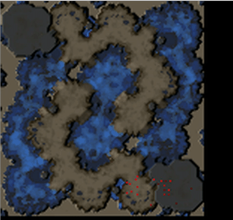

# DeepBuilder




```
pip install tensorflow keras opencv-python pillow sc2reader

Downloads 100 pages of 20 replays = 2000 replays
./python downloadreplays.py 100
./python generatetraindata.py
./python neuralnet.py

```