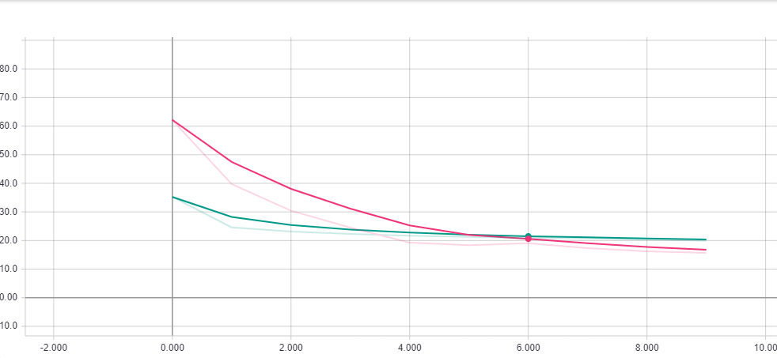

# TDDD92 Projekt


```
git clone https://github.com/alexvestin/DeepBuilder.git
cd DeepBuilder
pip install tensorflow keras pillow sc2reader
mkdir model replays training
```
Laddar ned 10 sidor med 20 replays per sida, använder proffsmatcher med minst en Terran
```
python downloadreplays.py 10
```
Genererar träningsbilder till nätverket, använder alla replays och skapar en bild per byggnad som placeras
```
python generatetraindata.py
```

Tränar ett CNN nätverk, baserat på [denna guide](https://pythonprogramming.net/training-neural-network-starcraft-ii-ai-python-sc2-tutorial/), fast med euklidiskt avstånd som cost function, samt två neuroner i ut-layer
```
python neuralnet.py
```

Ladda ned python bot
```
git clone https://gitlab.ida.liu.se/aleve030/sc2-python-bot.git
curl -i -X GET https://gitlab.ida.liu.se/course-starcraft-ai/pycommandcenter/uploads/064599832b001fbbf2b1e72c939ffa4d/library.cp37-win_amd64.pyd --output sc2-python-bot/library.cp37-win_amd64.pyd
```

Sedan i scriptet
```Python
import keras
import numpy as np
model = keras.load("model/model")
img = generate_image_from_board()
model.predict([img])
```

Loss funktion, Y-Axeln är euklidiskt avstånd i spelet, X nr Epocher
Grön linje är med ~30 000 samples per epoch och rosa med ~800


